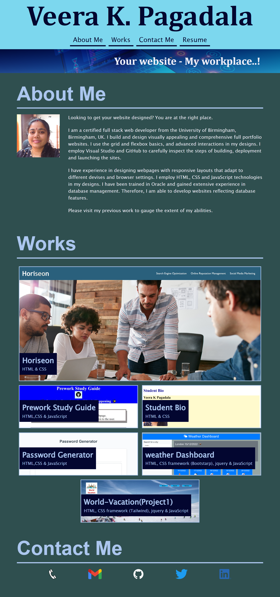

# Project Title: Professional Portfolio

## Project Description:
This project was to present the professional portfolio of a potential employee. I used this opportunity to design my portfolio with my professional and contact details. I provided links to the sections About Me, my previous Work and Contact Me and My Resume. I did this by using html and CSS allowing other developers who undertake the project to better understand where crucial elements relating to the project are placed and a making it easy for other developers to follow a rational flow.

## How to Use the Project:
Using this project will give new developers an idea of the fundamnetal principles in using semantic HTML elements and CSS for designing a website, there-by increasing visual appeal and improving structure to any given website.

## Credits:
Thanks to Instructor Mahyar Mottaghi Zadeh for providing relevent training and rescources for this project.

## Website URL and imange:

https://veerak21.github.io/portfolio/

980px screenshot

768px screenshot

